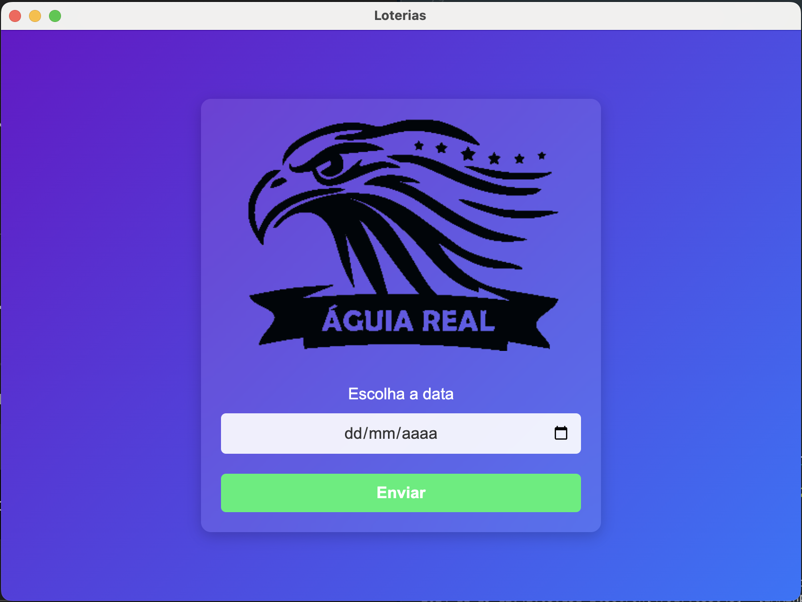

# Loterias Águia Real 🎲

Um aplicativo para consulta e processamento de resultados de loterias, com suporte para salvar dados em planilhas Excel e uma interface intuitiva desenvolvida com Electron.

## 📋 Funcionalidades

- **Interface amigável** para selecionar a data dos resultados.
- **Consulta automática** aos dados de diversas loterias com base na data fornecida.
- **Exportação dos resultados** em dois formatos no Excel:
  - **Tabela tradicional:** Dados organizados por data, loteria, posição, número e animal.
  - **Formato transposto:** Dados organizados em linhas com números e animais em colunas separadas.
- **Configuração de layout** otimizada para análise.
- **Diálogo interativo** para salvar arquivos no formato desejado.
- **Configurações de segurança avançadas**, com `contextIsolation` e `nodeIntegration` desativados.

## Captura de Tela

Aqui está uma prévia do aplicativo em ação:



## 🛠️ Tecnologias Utilizadas

- [Electron](https://www.electronjs.org/) - Framework para aplicativos desktop.
- [Axios](https://axios-http.com/) - Cliente HTTP para consumo de APIs.
- [XLSX](https://github.com/SheetJS/sheetjs) - Biblioteca para manipulação de arquivos Excel.
- [Electron Builder](https://www.electron.build/) - Ferramenta de empacotamento e distribuição.

## 📦 Estrutura do Projeto

```
loterias_aguia_real/
├── assets/                # Recursos do aplicativo, como ícones e
│   └── icons/             # Ícones do aplicativo
│       ├── icon.ico       # Ícone para Windows
│       └── icon.png       # Ícone para outros sistemas
│
├── dist/                  # Arquivos gerados após o build
├── main.js                # Código principal (processo Main do Electron)
├── preload.js             # Script de preload para comunicação segura
├── renderer.js            # Lógica da interface gráfica (processo Renderer)
├── index.html             # Interface gráfica do aplicativo
├── package.json           # Configuração do projeto Node.js e Electron
├── README.md              # Documentação do projeto
└── .gitignore             # Arquivo para ignorar arquivos no Git

```

## 🚀 Como Usar

### Pré-requisitos

- [Node.js](https://nodejs.org/pt) instalado na sua máquina. (versão LTS recomendada)
- Um editor de código, como o [Visual Studio Code](https://code.visualstudio.com/).
- [Git](https://git-scm.com/) para clonar o repositório

1. **Clone o repositório**:
   ```bash
   git clone https://github.com/usuario/loterias_aguia_real.git
   cd loterias_aguia_real
   ```
2. **Instale as dependências:**

No diretório do projeto, execute o comando:

```bash
npm install
```

3. Inicie o aplicativo em modo de desenvolvimento:

Para executar o aplicativo localmente:

```bash
npm start
```

4. Gerar a versão de produção:

Para criar uma versão executável do aplicativo, execute:

```bash

npm run build
```

5. **Testar o aplicativo _(opcional)_:**

Caso deseje testar o aplicativo gerado, navegue até a pasta `dist/` e execute o instalador ou executável correspondente ao seu sistema operacional.

## 🛠️ Contribuição

Contribuições são bem-vindas! Siga os passos abaixo para contribuir:

1. Faça um fork do repositório.
2. Crie uma nova branch: `git checkout -b minha-feature.`
3. Faça suas alterações e commit: `git commit -m 'Minha nova feature'.`
4. Envie suas mudanças: `git push origin minha-feature.`
5. Abra um Pull Request.

## 🛡️ Licença

Este projeto está licenciado sob a [MIT License](LICENSE). Consulte o arquivo `LICENSE` para mais informações.

---

💻 Desenvolvido por **Deloam.**
